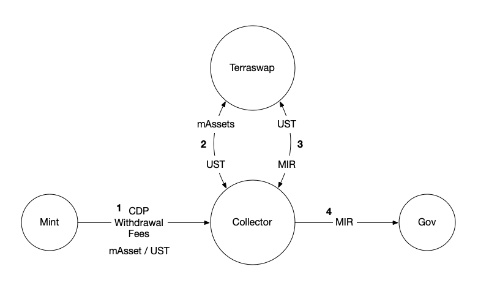

# Collector

The Collector accumulates fee rewards generated from CDP withdrawal within the protocol, and converts them into UST in order to purchase MIR from the MIR-UST Terraswap pool. The MIR is then sent to the [Gov Contract](gov.md) to supply trading fee rewards for MIR stakers.



## InitMsg



```rust
#[derive(Serialize, Deserialize, Clone, Debug, PartialEq, JsonSchema)]
pub struct InitMsg {
    pub distribution_contract: HumanAddr,
    pub terraswap_factory: HumanAddr,
    pub mirror_token: HumanAddr,
    pub base_denom: String,
    pub aust_token: HumanAddr,
    pub anchor_market: HumanAddr,
    pub bluna_token: HumanAddr,
    pub bluna_swap_denom: String,
}
```



```javascript
{
  "distribution_contract": "terra1...",
  "terraswap_factory": "terra1...",
  "mirror_token": "terra1...",
  "base_denom": "uusd", // native Terra token
  "aust_token": "terra1...", //aUST params
  "anchor_market": "terra1...",
  "bluna_token": "terra1...", //bLuna params
  "bluna_swap_denom": "uusd"
}
```



| Key | Type | Description |
| :--- | :--- | :--- |
| `distribution_contract` | HumanAddr | Contract address of [Mirror Governance](gov.md) |
| `terraswap_factory` | HumanAddr | Contract address of Terraswap Factory |
| `mirror_token` | HumanAddr | Contract address of Mirror Token \(MIR\) |
| `base_denom` | String | Base denomination \(native Terra token denom\) |
| `aust_token` | HumanAddr | Address of aUST token contract |
| `anchor_market` | HumanAddr | Address of Anchor Market contract |
| `bluna_token` | HumanAddr | Address of bLuna token contract |
| `bluna_swap_denom` | String | Base denomination which bLuna to be swapped into \(uusd\) |

## HandleMsg

### UpdateConfig

Updates the configuration of Collector contrat. Can only be called by owner. 



```rust
#[derive(Serialize, Deserialize, Clone, Debug, PartialEq, JsonSchema)]
#[serde(rename_all = "snake_case")]
pub enum HandleMsg {
    UpdateConfig {
        owner: Option<HumanAddr>,
        distribution_contract: Option<HumanAddr>,
        terraswap_factory: Option<HumanAddr>,
        mirror_token: Option<HumanAddr>,
        base_denom: Option<String>,
        aust_token: Option<HumanAddr>,
        anchor_market: Option<HumanAddr>,
        bluna_token: Option<HumanAddr>,
        bluna_swap_denom: Option<String>,  
    },
```



```javascript
{
    "update_config": {
        "owner": "terra1...",
        "distribution_contract": "terra1...",
        "terraswap_factory": "terra1...",
        "mirror_token": "terra1...",
        "base_denom": "uusd", // native Terra token
        "aust_token": "terra1...", //aUST params
        "anchor_market": "terra1...",
        "bluna_token": "terra1...", //bLuna params
        "bluna_swap_denom": "uusd"
    }
}
```



| Key | Type | Description |
| :--- | :--- | :--- |
| `owner`\* | HumanAddr | Address of the contract owner\* |
| `distribution_contract`\* | HumanAddr | Contract address of [Mirror Governance](gov.md) |
| `terraswap_factory`\* | HumanAddr | Contract address of Terraswap Factory |
| `mirror_token`\* | HumanAddr | Contract address of Mirror Token \(MIR\) |
| `base_denom`\* | String | Base denomination \(native Terra token denom\) |
| `aust_token`\* | HumanAddr | Address of aUST token contract |
| `anchor_market`\* | HumanAddr | Address of Anchor Market contract |
| `bluna_token`\* | HumanAddr | Address of bLuna token contract |
| `bluna_swap_denom`\* | String | Base denomination which bLuna to be swapped into \(uusd\) |

\*= optional

### `Convert`

Depending on `asset_token`, performs one of the following:

* if `asset_token` is an mAsset Luna or Anchor sells the contract's balance of that mAsset for UST on Terraswap
* if `asset_token` is the UST token, buys MIR off the MIR/UST Terraswap pool with the contract's UST balance
* if `asset_token` is aUST, or bLuna sells the token based on registered `anchor_market` or `bluna_swap_denom`



```rust
#[derive(Serialize, Deserialize, Clone, Debug, PartialEq, JsonSchema)]
#[serde(rename_all = "snake_case")]
pub enum HandleMsg {
    Convert {
        asset_token: HumanAddr,
    }
}
```



```javascript
{
  "convert": {
    "asset_token": "terra1..."
  }
}
```



| Key | Type | Description |
| :--- | :--- | :--- |
| `asset_token` | HumanAddr | Contract address of asset to convert |

### `LunaSwapHook`

Hook to swap Luna token to MIR.



```rust
#[derive(Serialize, Deserialize, Clone, Debug, PartialEq, JsonSchema)]
#[serde(rename_all = "snake_case")]
pub enum HandleMsg {
    LunaSwapHook {}
}
```



```javascript
{
  "send": {}
}
```



## QueryMsg

### `Config`

Get the Mirror Collector contract configuration.



```rust
#[derive(Serialize, Deserialize, Clone, Debug, PartialEq, JsonSchema)]
#[serde(rename_all = "snake_case")]
pub enum QueryMsg {
    Config {}
}
```

#### Response

```rust
#[derive(Serialize, Deserialize, Clone, Debug, PartialEq, JsonSchema)]
pub struct ConfigResponse {
    pub owner: HumanAddr,
    pub distribution_contract: HumanAddr, // collected rewards receiver
    pub terraswap_factory: HumanAddr,
    pub mirror_token: HumanAddr,
    pub base_denom: String,
    pub aust_token: HumanAddr,
    pub anchor_market: HumanAddr,
    pub bluna_token: HumanAddr,
    pub bluna_swap_denom: String,
}
```

| Key | Type | Description |
| :--- | :--- | :--- |
| `owner` | HumanAddr | Address of the contract owner\* |
| `distribution_contract` | HumanAddr | Contract address of [Mirror Governance](gov.md) |
| `terraswap_factory` | HumanAddr | Contract address of Terraswap Factory |
| `mirror_token` | HumanAddr | Contract address of Mirror Token \(MIR\) |
| `base_denom` | String | Base denomination \(native Terra token denom\) |
| `aust_token` | HumanAddr | Address of aUST token contract |
| `anchor_market` | HumanAddr | Address of Anchor Market contract |
| `bluna_token` | HumanAddr | Address of bLuna token contract |
| `bluna_swap_denom` | String | Base denomination which bLuna to be swapped into \(uusd\) |



```javascript
{
  "config": {}
}
```

#### Response

```rust
{
    "config_response": {
        "owner": "terra1...",
        "distribution_contract": "terra1...",
        "terraswap_factory": "terra1...",
        "mirror_token": "terra1...",
        "base_denom": "uusd", // native Terra token
        "aust_token": "terra1...", //aUST params
        "anchor_market": "terra1...",
        "bluna_token": "terra1...", //bLuna params
        "bluna_swap_denom": "uusd"
    }
}
```

| Key | Type | Description |
| :--- | :--- | :--- |
| `owner` | HumanAddr | Address of the contract owner\* |
| `distribution_contract` | HumanAddr | Contract address of [Mirror Governance](gov.md) |
| `terraswap_factory` | HumanAddr | Contract address of Terraswap Factory |
| `mirror_token` | HumanAddr | Contract address of Mirror Token \(MIR\) |
| `base_denom` | String | Base denomination \(native Terra token denom\) |
| `aust_token` | HumanAddr | Address of aUST token contract |
| `anchor_market` | HumanAddr | Address of Anchor Market contract |
| `bluna_token` | HumanAddr | Address of bLuna token contract |
| `bluna_swap_denom` | String | Base denomination which bLuna to be swapped into \(uusd\) |



