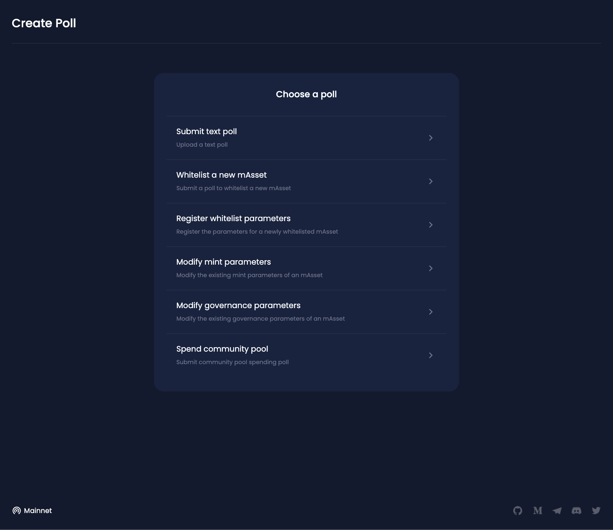
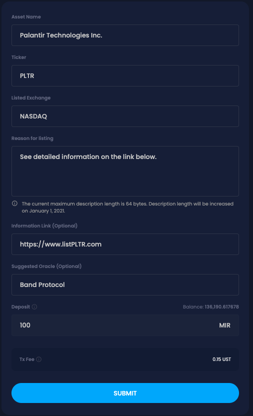
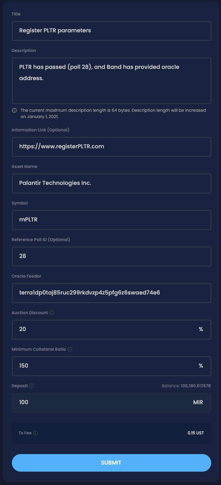
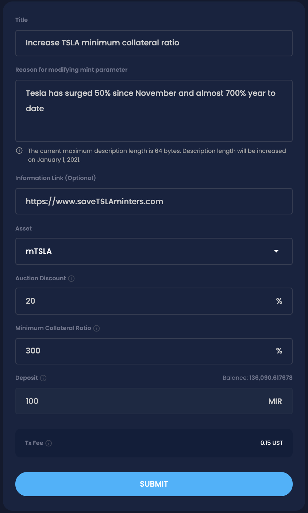
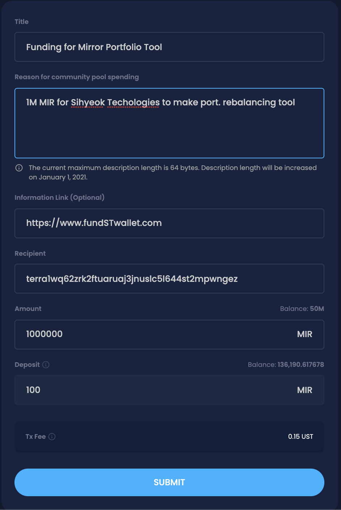

# Proposal Types

Governance proposals on the Mirror Protocol can come in a variety of formats. There are six different categories of proposals that can be made: **Whitelist a New mAsset**, **Register Whitelist Parameters**, **Modify Mint Parameters**, **Modify Governance Parameters**, **Spend Community Pool**, and **Submit Text Proposal**.

### 1. Submit text poll

The function of the text proposal is to allow proposals that do not fit the defined categories. Given that it is a basic text proposal, simple fields for the `Title`, `Description`, and an `Information Link` for additional information.

| Field | Description | Type |
| :--- | :--- | :--- |
| Title | Title of the poll | Required |
| Description | Short description of the poll | Required |
| Information Link | External URL for further information | Optional |

### 2. Whitelist a New mAsset


The full process of getting a new asset to be fully operational on the Mirror Protocol is described [here](whitelist-procedure.md).


The function of this proposal is to start a poll to whitelist a new asset. Given that this is a simple text proposal, there are a few fields that need to be filled. The `Asset Name`, `Ticker`, `Listed Exchange`, and `Reason for listing` are required. Due to the limitations on the length of the description field of the underlying smart contracts, the current maximum length is 64 bytes \(will be increased to 1024 bytes on December 31, 2020\). It is suggested that additional information be added on a separate web page and linked to using the `Information Link` field.

Information that would be necessary for a voter to make an informed decisions should be clearly stated in addition to reasons for listing this asset and the asset name and ticker. For example, simply stating:

`Google should be listed because it is a popular stock`

has numerous problems. First, the specific exchange that the price feed should be taken from is not clearly stated \(many companies are dual listed\). Second, Google actually has two stocks that are publicly traded: `GOOGL` and `GOOG` \(the former has voting rights whereas the latter does not\). In addition, the official name registered with NASDAQ is not `Google` but rather `Alphabet Inc.` Thus it is extremely important to make it as clear as possible to others about the asset that you intend to whitelist.

| Field | Description | Type |
| :--- | :--- | :--- |
| Asset Name | Name of the asset to be whitelisted | Required |
| Ticker | Ticker of asset to be whitelisted | Required |
| Listed Exchange | Exchange that the underlying asset trades on | Required |
| Reason for listing | Short description of whitelist reason | Required |
| Information Link | External URL for further information | Optional |
| Suggested Oracle | Oracle provider or address | Optional |

### 3. Register Whitelist Parameters

If a proposal to whitelist is approved, another poll must be passed to set the parameters of the newly listed asset. The required fields include `Title`, `Description`, `Asset Name`, `Symbol`, `Oracle Feeder` \(address\), `Auction Discount`, and the `Minimum Collateral Ratio`. Again, it is advised to include reference to the passed whitelist poll as well as reasoning for choosing the given oracle address. Given that the Mirror Protocol is in its early stages, it is advisable to keep the parameters equal to existing parameters for already listed assets \(Auction Discount at 20%, and Minimum Collateral Ratio at 150%\).  
  
The original 13 mAssets utilize Band Protocol’s feeders, so a rough guideline to communicate with Band Protocol to receive the oracle address is provided below. If another another oracle address would like to be suggested, please input the address in the Oracle Feeder field.


To ensure proper functioning of the price feed, newly whitelisted asset on Mirror Protocol also undergo a 1 week testing period where the prices are still fed by the oracle but no buy/sell, mint, or staking actions can be performed. 


| Field | Description | Type |
| :--- | :--- | :--- |
| Title | Title of the poll | Required |
| Description | Short description of the poll | Required |
| Information Link | External URL for further information | Optional |
| Asset Name | Name of the asset to be whitelisted | Required |
| Symbol | Ticker to be used on Mirror Protocol \(format: m+ticker\) | Required |
| Reference Poll ID | Poll ID of referenced poll \(ex. whitelisting poll\) | Optional |
| Oracle Feeder | Oracle feed address | Required |
| Auction Discount | Discount ratio applied during CDP liquidation auction | Required |
| Minimum Collateral Ratio | Minimum collateral ratio applied when opening a mint position | Required |

### 4. Modify Mint Parameters

Through this poll, the existing Mirror Protocol parameters for a specific individual mAsset can be modified. The possible parameters to be updated consist of either the `Auction Discount` and the `Minimum Collateral Ratio`.

| Field | Description | Type |
| :--- | :--- | :--- |
| Title | Title of the poll | Required |
| Reason for modifying governance parameter | Short description of the poll | Required |
| Information Link | External URL for further information | Optional |
| Quorum | Minimum quorum required for accepting a poll \(in percentage\) | Optional |
| Threshold | Minimum percentage of `YES` votes to pass a poll \(in percentage\) | Optional |
| Voting Period | Length of poll \(in units of blocks\) | Optional |
| Effective Delay | Length of delay before protocol integration for a passed poll \(in units of blocks\) | Optional |
| Expiration Period | Length of expiration period for a failed poll \(in units of blocks\) | Optional |
| Proposal Deposit | Minimum deposit to start a poll \(in units of MIR\) | Optional |

### 5. Modify Governance Parameters 

Similar to modifying mint parameters, governance parameters such as the `Quorum`, `Threshold`, `Voting Period`, `Effective Delay`, `Expiration Period`, and `Proposal Deposit` can be modified.

| Fields | Description | Type |
| :--- | :--- | :--- |
| Title | Title of the poll | Required |
| Reason for modifying governance parameter | Short description of the poll | Required |
| Information Link | External URL for further information | Optional |
| Quorum | Minimum quorum required for accepting a poll \(in percentage\) | Optional |
| Threshold | Minimum percentage of `YES` votes to pass a poll \(in percentage\) | Optional |
| Voting Period | Length of poll \(in units of blocks\) | Optional |
| Effective Delay | Length of delay before protocol integration for a passed poll \(in units of blocks\) | Optional |
| Expiration Period | Length of expiration period when for a failed poll \(in units of blocks\) | Optional |
| Proposal Deposit | Minimum deposit to start a poll \(in units of MIR\) | Optional |

### 6. Spend community pool

Proposals relating to spending the accrued MIR tokens in the community pool can be made under this section. The proposal should ideally specify the reasons for the distribution and identify the recipient and amount to be given.

| Fields | Description | Type |
| :--- | :--- | :--- |
| Title | Title of the poll | Required |
| Reason for community pool spending | Short description of the poll | Required |
| Information Link | External URL for further information | Optional |
| Recipient | Grant recipient address | Required |
| Amount | Grant amount \(in units of MIR\) | Required |

